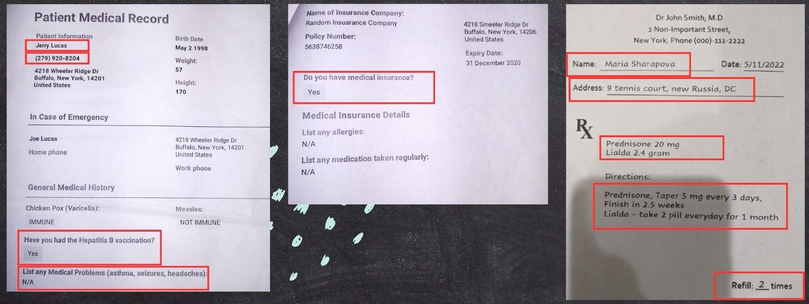
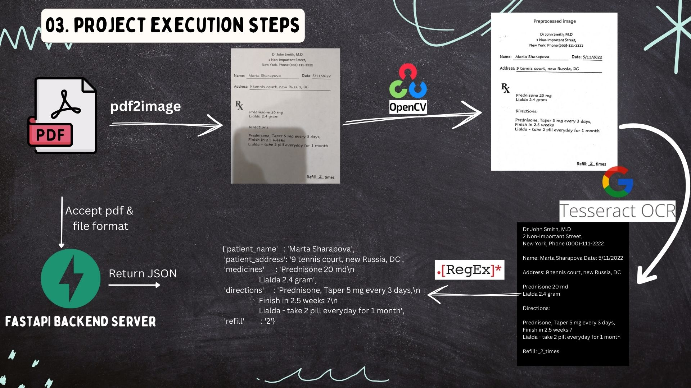

# Medical Data Extraction
An OCR project to extract information about Patient and Prescription details from PDF Documents.
Also this project involved creation of a backend server which will process data extraction requests.

## Demo

https://github.com/abhijeetk597/medical-data-extraction/assets/138308825/3d5d90e8-2858-4831-b1d5-97a3874f256c

## [Click here to see project presentation](https://youtu.be/xh0livz2tSY)

## Overview
1. [What is OCR?](#a1)
2. [Introduction to Project](#a2)
3. [Project Execution Steps](#a3)
4. [Code Walkthrough](#a4)
5. [What did I learn through this project?](#a5)
6. [Challenges Faced](#a6)
7. [Directory Structure](#a7)
8. [If you are cloning my repo?](#a8)

## <a name="a1">1. What is OCR?</a>
OCR stands for Optical Character Recognition. It's a technology that enables the conversion of different types of documents, such as scanned paper documents, PDF files, or images captured by a digital camera, into editable and searchable data. Essentially, OCR software identifies text within images or scanned documents and converts it into machine-readable text.

Machine learning and AI play significant roles in OCR technology. Machine learning (ML) powers OCR to turn images into text. ML algorithms like convolutional neural networks (CNNs) are trained on massive datasets to recognize characters. ML also helps extract key features from images and utilizes language models to understand context and improve accuracy, especially for ambiguous characters. OCR systems continuously learn and adapt to specific domains and languages through ML, ensuring ever-better performance.

Here are some common applications and domains where OCR is used:

1. **Document Digitization**: OCR is extensively used to convert scanned documents, PDFs, and images into editable and searchable text. This is useful in offices, libraries, and archives for digitizing large volumes of documents for easier storage, retrieval, and sharing.

2. **Data Entry Automation**: OCR automates data entry processes by extracting text from documents such as invoices, receipts, and forms. This saves time and reduces errors associated with manual data entry tasks.

3. **Banking and Finance**: OCR is employed in banking for reading checks, processing forms, and extracting information from financial documents. It facilitates faster processing of transactions and improves accuracy in tasks like check reading and automated form filling.

4. **Healthcare**: In healthcare, OCR assists in digitizing medical records, prescriptions, and patient forms. It enables quick access to patient information, enhances data accuracy, and streamlines administrative tasks in hospitals and clinics.

5. **Retail and E-commerce**: OCR is used in retail for tasks like inventory management, barcode scanning, and automatic price recognition. In e-commerce, it helps extract product information from images and catalogs, improving searchability and customer experience.

6. **Automated License Plate Recognition (ALPR)**: OCR technology is utilized in ALPR systems for reading license plates on vehicles. It's employed in various applications such as traffic management, toll collection, parking enforcement, and security surveillance.

7. **Translation Services**: OCR assists in language translation by converting printed text from one language into machine-readable text, which can then be processed by translation software. This enables the automatic translation of documents and websites.

8. **Accessibility**: OCR helps individuals with visual impairments by converting printed text into accessible formats such as audio or Braille. It allows them to access information from printed materials like books, documents, and signs.

9. **Legal and Compliance**: In legal and compliance domains, OCR is used for searching and analyzing large volumes of legal documents, contracts, and regulatory filings. It facilitates faster retrieval of relevant information and aids in compliance monitoring.

10. **Education**: OCR is employed in educational institutions for tasks like grading exams, digitizing textbooks, and converting handwritten notes into editable text. It assists in creating accessible learning materials and automating administrative processes.


## <a name="a2">2. Introduction to Project</a>
> Whenever we go to hospital, we always fill up some kind of forms and our medical history is created using those forms, prescriptions, test reports. Sometimes, this medical history is used for other purposes like claiming health insurance etc

>Health Insurance company might receive thousands of such documents from multiple sources and creating a record of useful information from customers medical history is a very cumbersome task and requires huge manpower. And hence this kind of tasks can be sped up using OCR technology.

For this project we have two types of Medical Documents.
1. Patient Medical Record
2. Prescription

We are going to extract some important fields from these documents.


### Why this project?
Though I have been learning Data Science, then why am I doing this project? Mainly there are 3 reasons.
01. OCR is a subset of Computer Vision. OCR can be used in an NLP project like summarizing text using LLM.
02. This project involves very fundamental concepts of Python programming like OOP and Modular programming which are industry best practices.
03. Also this project involves creation of a backend server using FastAPI, which is known for its performance and many world-renowned companies such as Uber, Netflix and Microsoft use FastAPI to build their applications.

## <a name="a3">3. Project Execution Steps</a>
- **Step 1:** Convert pdf to image using `pdf2image` library
- **Step 2:** Preprocess the image (Apply `adaptive thresholding and binarization using OpenCV2`)
- **Step 3:** Extracting text from image by passing it through `tesseract OCR engine`
- **Step 4:** Finding useful information from text using `RegEx` and returning in JSON format
- **Step 5:** Creating a `FastAPI backend server` which serves data extraction requests by accepting a pdf_file, file_format and returning a JSON object.
- **Step 6:** To create a Demo of `frontend UI using Streamlit` and connect it with our FastAPI server using Python Requests module.


## <a name="a4">4. Code Walkthrough</a>
Explore notebooks and source code of this project.
 - Notebook 1: [Prescription_parser](https://github.com/abhijeetk597/medical-data-extraction/blob/main/Notebooks/01_prescription_parser.ipynb)
 - Notebook 2: [Patient_details_parser](https://github.com/abhijeetk597/medical-data-extraction/blob/main/Notebooks/02_patient_details_parser.ipynb)
 - Backend: [Source code directory](https://github.com/abhijeetk597/medical-data-extraction/tree/main/backend/src)
 - Frontend: [Streamlit app](https://github.com/abhijeetk597/medical-data-extraction/blob/main/frontend/app.py)

## <a name="a5">5. What did I learn through this project?</a>
- How to use OCR for real world projects and key image processing concepts like thresholding using `OpenCV2`.
- Polished up my Python coding skills by using `OOP, code refactoring and modular programming`.
- Setting up of a backend server using `FastAPI` framework.
- Unit testing using `Pytest`.
- How to use `Postman` for API testing.
- I could connect Streamlit frontend with FastAPI backend server using `Python requests` module.

## <a name="a6">6. Challenges faced during this project</a>
- In adapative thresholding, it requires lot of trial and error to reach optimum values of block size and constant.
- Pytest is not properly integrated with VSCode.
- Also I faced path related errors during unit testing even in PyCharm.
- When creating streamlit app, there are very few practical instructions available on internet for connecting it with a backend server and sending files across.

## <a name="a7">7. Directory Structure of Project</a>
```
medical-data-extraction
│   .gitignore
│   README.md
│   requirements.txt
│
├───backend
│   │
│   ├───resources
│   │   │
│   │   ├───patient_details
│   │   │       pd_1.pdf
│   │   │       pd_2.pdf
│   │   │
│   │   └───prescription
│   │           pre_1.pdf
│   │           pre_2.pdf
│   │
│   ├───src
│   │       extractor.py
│   │       main.py              //Fastapi Backend Server
│   │       parser_generic.py
│   │       parser_patient_details.py
│   │       parser_prescription.py
│   │       utils.py
│   │    
│   ├───tests
│   │       test_prescription_parser.py
│   │
│   └───uploads
│
├───frontend
│       app.py              //Streamlit app
│
├───Notebooks
│       01_prescription_parser.ipynb
│       02_patient_details_parser.ipynb
│       03_RegEx.ipynb
│    
└───reference
        tesseract_papar_by_google.pdf
```
## <a name="a8">8. If you are cloning this repository?</a>
- Install all dependancies from `requirements.txt`
- For `pdf2image` you need to [download `poppler`](https://github.com/belval/pdf2image?tab=readme-ov-file#how-to-install)
- Install Tesseract OCR Engine in your PC
    - [Tesseract installation instrution : Github](https://github.com/tesseract-ocr/tesseract#installing-tesseract)
    - [Tesseract windows specific instructions: Github](https://github.com/UB-Mannheim/tesseract/wiki)
- Set required PATHs as per your environment
> [Demo video to clone and run this project in your machine.](https://youtu.be/UWmOePHzePM)
